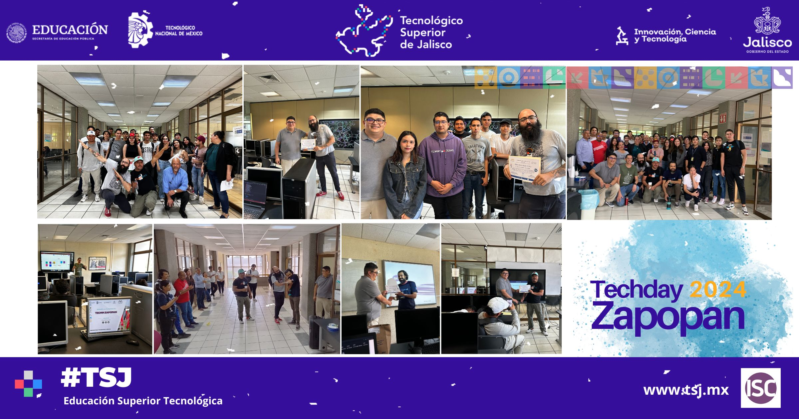

 

  <strong>¡Gracias por participar en la edición 2024! ¡Nos vemos el próximo año!</strong>

  

# 🚀 Techday 2025 Zapopan 09.05.25

---

## 📢 CONFERENCIAS
📍 *En el Edificio L Sistemas*

| 🕒 Horario | 🗣️ Tema | 👨‍🏫 Ponente |
|:------------:|:-------------------------:|:------------------------:|
| **8:15** | **Inauguración del evento Edificio L ** | Academia ISC |
| **8:30** | **12 cosas que aprendí en 12 años** | *Juan Carlos Sedano Salas* |
| **9:00** | **Cómo obtener el trabajo y pasar la entrevista técnica** | *Daniel Góngora* |
| **9:30** | **Tú no eres tu código** | *Sinuhe Jaime Valencia* |
| **10:00** | **Desventajas sobre ser aprendiz de todo** | *José Somilleda* |
| **10:30** | **La evolución del desarrollo web** | *Orlando Cano* |

---

## 🛠️ TALLERES SIMULTÁNEOS
📍 *A partir de las 12:00 en el Edificio L Sistemas*

| 💼 Taller | 👨‍🏫 Ponente |
|:-----------------------------:|:------------------------------:|
| **☁️ Cloud: mito y realidad** | *Hazzim Anaya* |
| **🤖 Más allá del hype: Cómo funcionan y se usan los modelos de IA** | *Juan Carlos Sedano Salas* |
| **💻 Fullstack Development con SpringBoot, Java y ReactJS** | *Orlando Cano* |
| **📱 Kotlin desde cero orientado a patrones de diseño** | *José Somilleda, Daniel Góngora, Sinuhe Jaime Valencia* |

---

📝 **Evento organizado por el TSJ Zapopan y la academia ISC**

📅 **09/05/2025**

