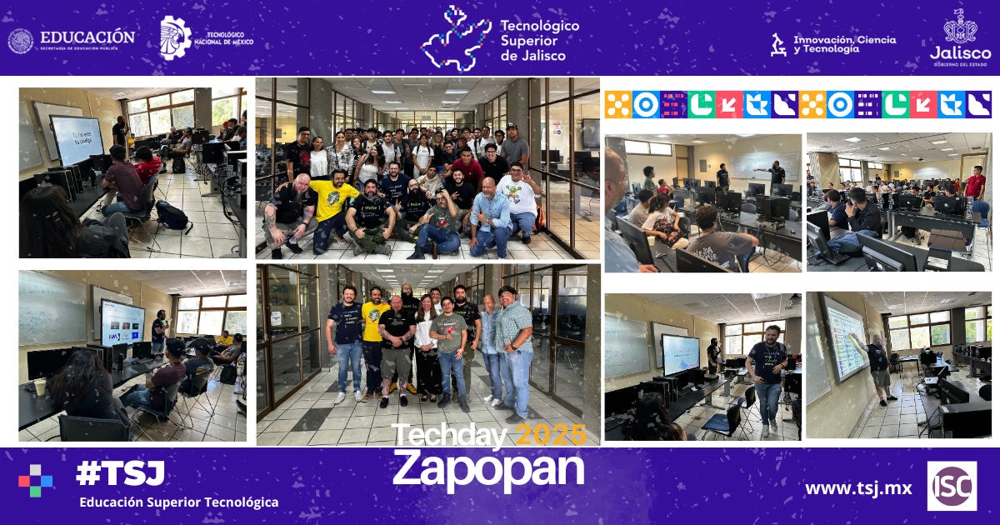

 
<!--

  <strong>¡Gracias por su interés en Techday 2026! ¡Nos vemos el próximo año!</strong>

 -->

  

# Techday 2026 Zapopan 28.05.26
## [REGISTRO <------ AQUÍ](https://forms.gle/TuuN6CB5kGeCkYbu8)

## [ENCUESTA DE PARTICIPACIÓN <------ AQUÍ](https://forms.gle/U7kh5zRiP5eq29es6)
---

##  CONFERENCIAS
Edificio "L" Laboratorios de Sistemas*

|  Horario |  Tema |  Ponente |
|:------------:|:-------------------------:|:------------------------:|
| Por definir | Por definir | Por definir |

---

  

##  ¡TALLERES SIMULTÁNEOS 9:00 am a 12:00 pm!
Edificio "L" Laboratorios de Sistemas*

---

###  Taller 1 – Laboratorio **LIA**
**Tu primera app mobile**  
**Ponente:** Sinuhe Jaime Valencia  

  

**Descripción:**  
Taller práctico orientado a estudiantes que desean iniciar en el desarrollo de aplicaciones móviles. Se abordarán conceptos básicos de estructura, interfaz de usuario y ejecución de una app funcional en Android.

**Requerimientos:**  
- Laptop con Windows, macOS o Linux  
- Android Studio instalado  
- JDK 11 o superior  
- Emulador configurado o dispositivo Android con depuración USB  

---

###  Taller 2 – Laboratorio **LTI**
**GitHub Copilot and Claude, from the beginning to build a small service**  
**Ponentes:** Orlando Cano, Christian Gómez  

  
  &nbsp;&nbsp;
  

**Descripción:**  
Introducción al uso de herramientas de inteligencia artificial para el desarrollo de software. Los participantes aprenderán cómo GitHub Copilot y Claude pueden asistir en la generación de código y construcción de un pequeño servicio.

**Requerimientos:**  
- Laptop con acceso a internet  
- Cuenta activa en GitHub  
- Visual Studio Code instalado  
- Extensión GitHub Copilot configurada  
- Navegador web actualizado  

---

###  Taller 3 – Laboratorio **LIS**
**Introducción a la línea de comandos**  
**Ponentes:** Juan Carlos Sedano, Daniel Delgado Vargas.  

  
   &nbsp;&nbsp;
  

**Descripción:**  
Taller introductorio para el uso eficiente de la línea de comandos en distintos sistemas operativos. Se revisarán comandos esenciales para la navegación de directorios, manejo de archivos y tareas básicas de automatización.

**Requerimientos:**  
- Laptop con Windows, Linux o macOS  
- Terminal instalada (PowerShell, Bash o equivalente)  
- Conocimientos básicos de uso de computadora  

---

 **Evento organizado por el TSJ Zapopan y la academia ISC**

 **28/05/2026**